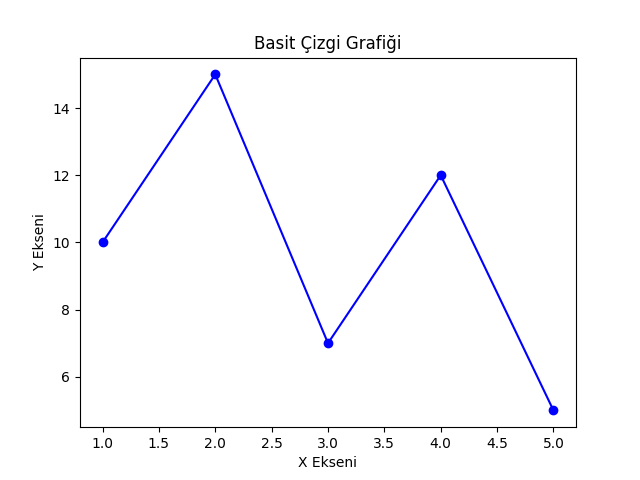
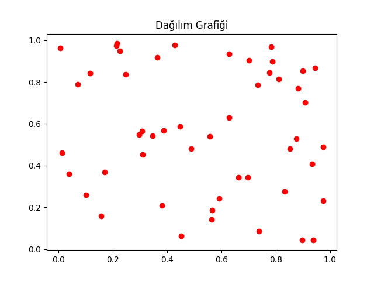
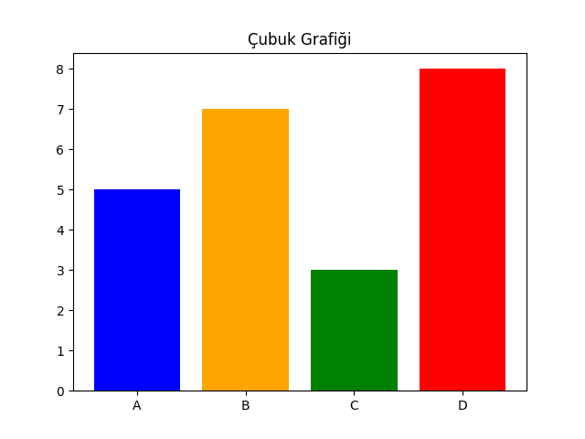
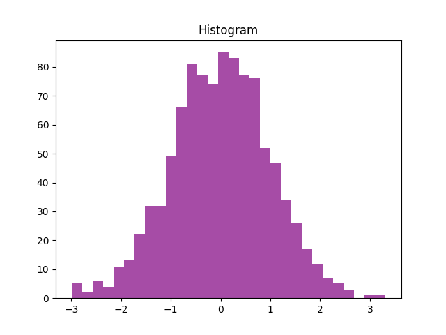
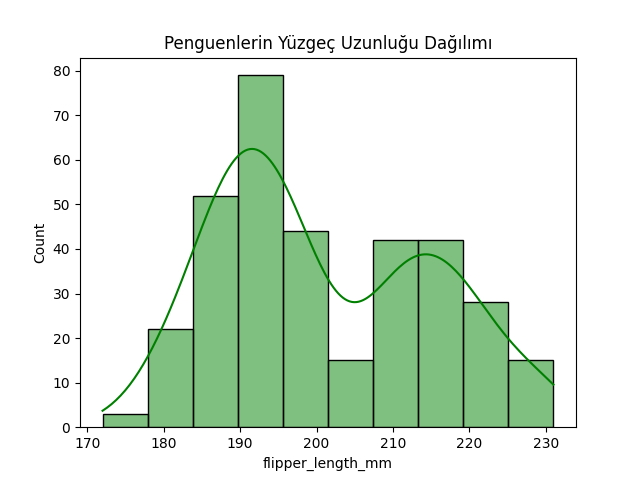
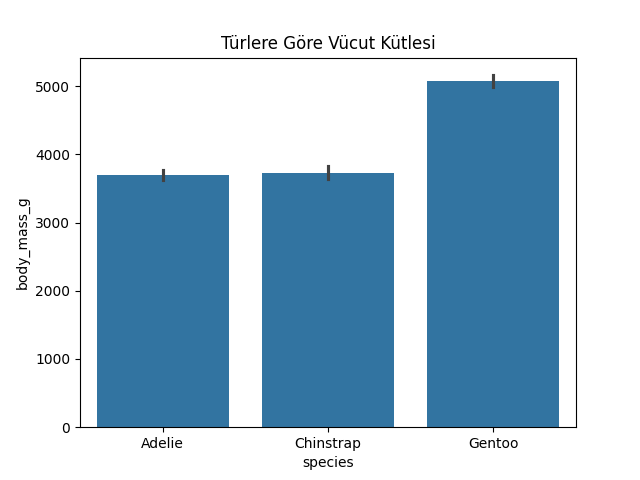
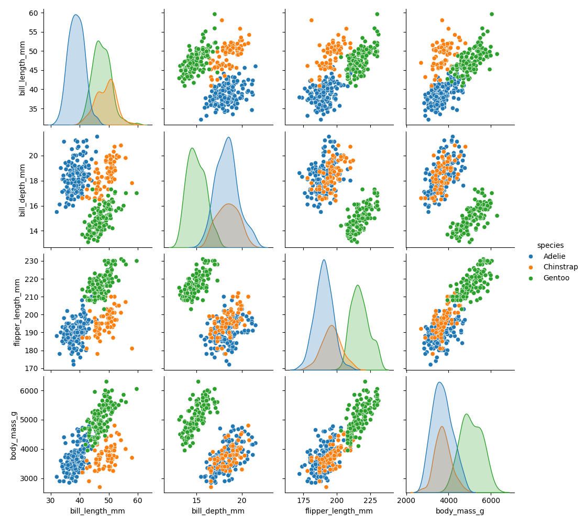
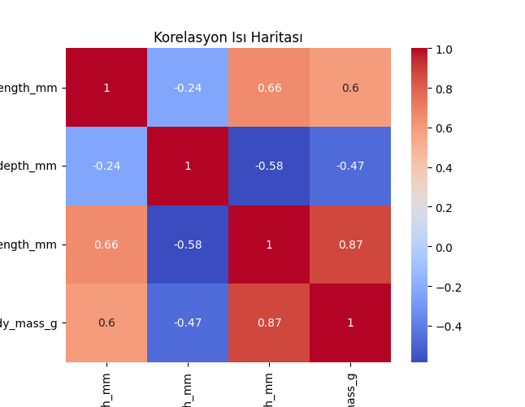

# 📊 Matplotlib & Seaborn: Sıfırdan Zirveye

**Matplotlib ve Seaborn**, Python'da veri görselleştirme için kullanılan en güçlü kütüphanelerden ikisidir. **Matplotlib**, temel grafik çizimleri yaparken; **Seaborn**, istatistiksel görselleştirme için daha gelişmiş ve estetik grafikler sunar.

---

## 🚀 1. Matplotlib & Seaborn Kurulumu

Eğer yüklü değilse, aşağıdaki komutla yükleyebilirsin:

```bash
pip install matplotlib seaborn
```

Kütüphaneleri içe aktaralım:

```python
import matplotlib.pyplot as plt
import seaborn as sns
```

---

## 📌 2. Matplotlib ile Grafik Çizme

Matplotlib'de temel olarak **line plot (çizgi grafiği), scatter plot (dağılım grafiği), bar chart (çubuk grafiği) ve histogram** kullanılır.

### 📌 2.1 Basit Çizgi Grafiği
```python
import matplotlib.pyplot as plt

x = [1, 2, 3, 4, 5]
y = [10, 15, 7, 12, 5]

plt.plot(x, y, marker='o', linestyle='-', color='b')
plt.title("Basit Çizgi Grafiği")
plt.xlabel("X Ekseni")
plt.ylabel("Y Ekseni")
plt.show()
```


---

### 📌 2.2 Dağılım Grafiği (Scatter Plot)
```python
import numpy as np
import matplotlib.pyplot as plt

x = np.random.rand(50)
y = np.random.rand(50)

plt.scatter(x, y, color='r')
plt.title("Dağılım Grafiği")
plt.show()
```


---

### 📌 2.3 Çubuk Grafiği (Bar Chart)
```python
kategoriler = ['A', 'B', 'C', 'D']
değerler = [5, 7, 3, 8]

plt.bar(kategoriler, değerler, color=['blue', 'orange', 'green', 'red'])
plt.title("Çubuk Grafiği")
plt.show()
```


---

### 📌 2.4 Histogram (Dağılım Analizi)
```python
data = np.random.randn(1000)

plt.hist(data, bins=30, color='purple', alpha=0.7)
plt.title("Histogram")
plt.show()
```


---

## 🎨 3. Seaborn ile Gelişmiş Grafikler

Seaborn, Matplotlib üzerine inşa edilmiştir ve daha estetik grafikler sunar.

### 📌 3.1 Seaborn ile Histogram ve KDE Grafiği
```python
df = sns.load_dataset("penguins")

sns.histplot(df["flipper_length_mm"], kde=True, color='g')
plt.title("Penguenlerin Yüzgeç Uzunluğu Dağılımı")
plt.show()
```


---

### 📌 3.2 Seaborn ile Kategorik Çizimler (Barplot, Boxplot)

```python
sns.barplot(x="species", y="body_mass_g", data=df)
plt.title("Türlere Göre Vücut Kütlesi")
plt.show()
```


```python
sns.boxplot(x="species", y="flipper_length_mm", data=df)
plt.title("Boxplot ile Yüzgeç Uzunluğu")
plt.show()
```


---

### 📌 3.3 Dağılım ve Korelasyon Grafikleri

```python
sns.pairplot(df, hue="species")
plt.show()
```


```python
sns.heatmap(df.corr(), annot=True, cmap='coolwarm')
plt.title("Korelasyon Isı Haritası")
plt.show()
```


---

## 🎯 4. Matplotlib & Seaborn ile Gerçek Dünya Kullanımları

✔ **Veri Analizi:** Büyük veri setlerini daha iyi anlamak için kullanılır.  
✔ **Makine Öğrenmesi:** Modelleme öncesi veri keşfi ve görselleştirme için kullanılır.  
✔ **İş Zekası:** Şirketlerde raporlama ve karar destek sistemlerinde kullanılır.  

---

## 🎓 Sonuç
Bu rehberde **Matplotlib ve Seaborn kütüphanelerini sıfırdan zirveye** kadar öğrendik. Daha fazla bilgi için [Matplotlib Resmi Dökümantasyonu](https://matplotlib.org/stable/contents.html) ve [Seaborn Resmi Dökümantasyonu](https://seaborn.pydata.org/) adreslerini ziyaret edebilirsin! 🚀
